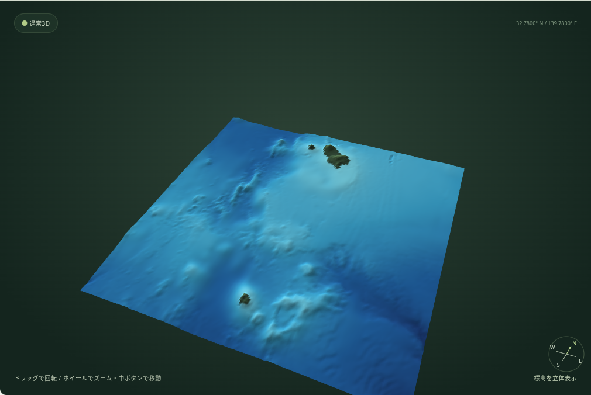
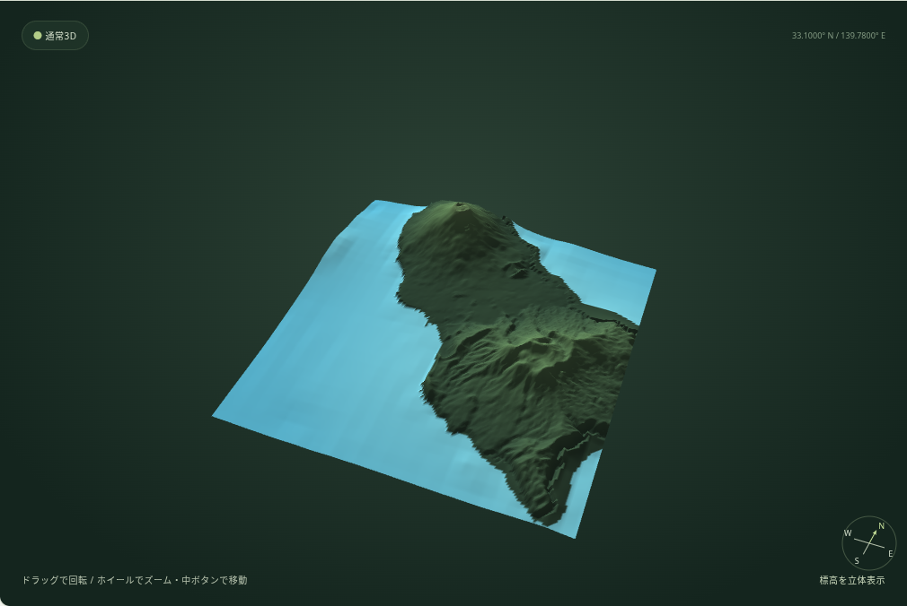
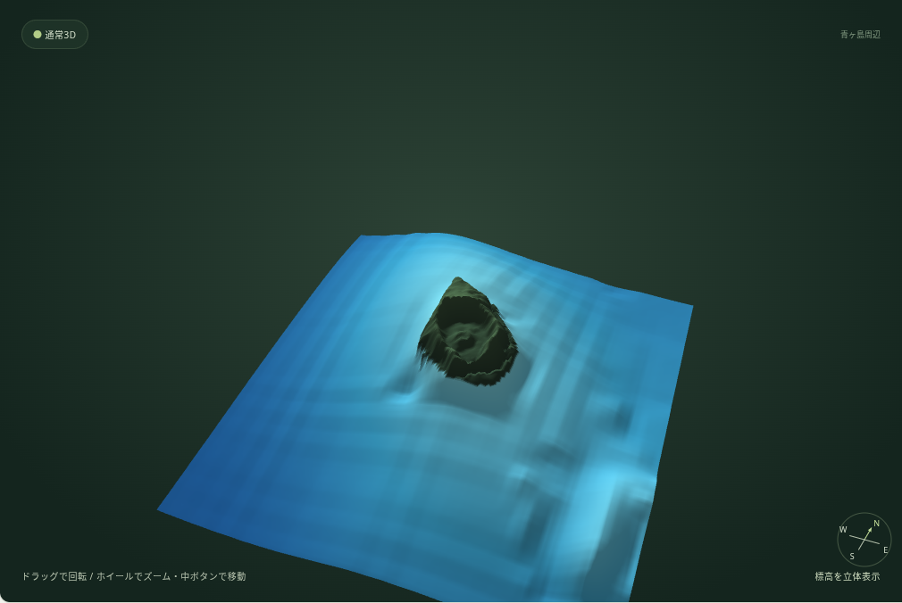
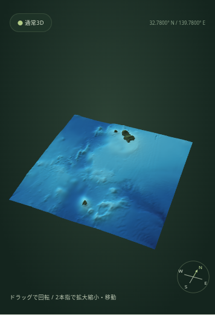
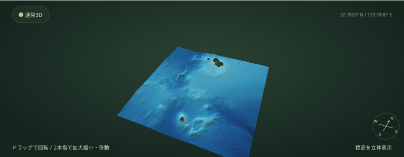
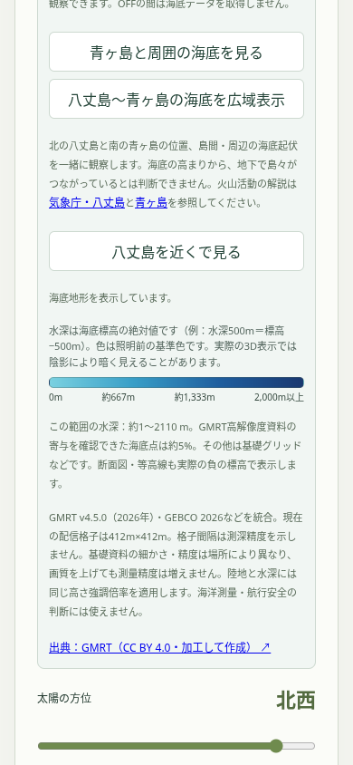

# 水深凡例・八丈島〜青ヶ島の広域海底表示（0.36.0）

## 使い方

3D設定の「海底地形を表示」がONの間、水深色の凡例が表示されます。色は浅い順に `#7AD1E0`（0m）、`#389EC7`（約667m）、`#1F5E9E`（約1,333m）、`#1A3870`（2,000m以上）。既存の3D配色計算と同じ配列・関数から凡例を組み立てています。水深は標高の絶対値で、たとえば水深500mは海底標高−500mです。描画時は照明が加わるため、画面上の青は凡例より暗く見えることがあります。水深2,000mを超える箇所も最も濃い青に固定されます。

設定欄のボタンで「青ヶ島と周囲の海底を見る」「八丈島〜青ヶ島の海底を広域表示」「八丈島を近くで見る」を切り替えます。広域では北の八丈島、南の青ヶ島、両島間と周辺海底の高まりを観察できます。両島の位置は気象庁が公表する座標で約76km離れています。広域表示は地形の位置関係を示すもので、地下で島々がつながっていることを示しません。火山の解説は[気象庁・八丈島](https://www.data.jma.go.jp/vois/data/tokyo/321_Hachijojima/321_index.html)、[気象庁・青ヶ島](https://www.data.jma.go.jp/vois/data/tokyo/322_Aogashima/322_index.html)を参照してください。

共有リンクは場所・縮尺・カメラ状態・海底表示ON/OFFを従来の形式で保存します。狭域と広域のデータはどちらもメモリにキャッシュし、切替時に再取得しません。対応範囲外は海底を補わず、理由を表示して陸地を維持します。

## 実データと出典

GMRT公式GridServerからGitHub Actions runnerを通じて取得しました（[取得ジョブ](https://github.com/enou123/terrain-stereo/actions/runs/38040261313)）。開発環境からの直接通信は403で拒否されたため、前段階で検証済みの代替経路を使っています。配信範囲は東経138.65〜140.95度、北緯31.9〜33.65度で、実データの境界は138.6453〜140.9524度、北緯31.8944〜33.6531度です。

[狭域ソース](https://www.gmrt.org/services/GridServer?west=139.2&east=140.3&south=32.0&north=32.9&layer=topo&format=geotiff&mresolution=500)、[広域topoソース](https://www.gmrt.org/services/GridServer?west=138.65&east=140.95&south=31.9&north=33.65&layer=topo&format=geotiff&mresolution=500)、[高解像度寄与mask](https://www.gmrt.org/services/GridServer?west=138.65&east=140.95&south=31.9&north=33.65&layer=topo-mask&format=geotiff&mresolution=500)。取得時に両タイルともHTTP 200。GMRTv4.5.0（2026年6月）のGeoTIFFは524×475、EPSG:4326、Float32。要求値500mに対する実格子間隔は緯度32.8度付近で東西約412m・南北約412mでした。これは格子間隔で、実測点の精度を意味しません。

248,900格子のうち247,852点に値があり、欠測は1,048点です。海面より低い点は247,340。海底は−3,653〜−0.45m、陸上の正値は最大約784mです。島間の代表点は−534m、西側は−754m、東側は−1,185m。八丈島西山・青ヶ島の陸上値は国土地理院DEMを優先して保持します。実画面の広域メッシュは37,249頂点、73,728三角形で、全三角形を描画しました。

高解像度寄与maskが有効な海底格子は16,991点（約6.9%）。その他はGMRTの基盤グリッド等です。GMRT現行概要はGEBCO 2026などを基礎に複数資料を統合すると説明しています。格子だけから各地点の船舶測深・年代・精度を特定しません。

素材の条件は[GMRT利用条件](https://www.gmrt.org/about/terms_of_use.php)のCC BY 4.0です。出典：Ryan et al. (2009), DOI [10.1029/2008GC002332](https://doi.org/10.1029/2008GC002332)、データ DOI [10.1594/IEDA.100001](https://doi.org/10.1594/IEDA.100001)。この領域を切り出し、海抜値を1m単位に丸め、欠測値と高解像度maskを保持した処理を適用しています。海底データの配信binaryは約529KB、manifestとの合計約531KBです。狭域は約523KBで、既存の量と同等です。

## 実画面検証

Chromium＋Playwright、WebGL ANGLE/SwiftShader、国土地理院の実DEMでPC 1440×900・スマートフォン相当390×844と844×390を確認しました。青ヶ島狭域、八丈島近景、広域を往復し、画面ごとにどちらのGMRTグリッドを選ぶか、ON/OFFと再表示時のキャッシュを検証。OFFでは海底リクエストが0、データ切替では各領域manifest/binaryを1度ずつ取得し、再訪時は追加通信なし。JSエラーとWebGLエラーはありません。

ボタン押下から海底が表示されるまでの計測（通常DEMの移動・取得を含む）はPC約2.73秒、縦画面約0.81秒、横画面約1.04秒。いずれも地域グリッドをmanifestとbinaryの2リクエストで読みます（約531KB）。Chromiumが報告したJS heapは操作前後で、PC約20.4→33.3MB、縦画面約20.9→31.9MB、横画面約19.5→33.9MBでした。GCや既存DEMキャッシュで変動する値です。GPUメモリ・実機の常駐量は示しません。

測定は実GMRTデータ・実GSI DEMを使用しました。実iPhone Safariと各端末の実GPU速度は未確認です。断面図や共有など既存機能のChromium回帰も併せて実施し、個別の実測地点情報と地質図データが海底まで測ったかのようには表示しません。

スクリーンショットはこのフォルダにあります。PC・スマホ縦横の3D広域、狭域・八丈島近景、凡例表示を記録しています。

### PC・八丈島〜青ヶ島と周辺海底

### PC・八丈島の近景

### PC・青ヶ島の狭域（従来機能）

### iPhone相当・縦画面

### iPhone相当・横画面

### 水深カラースケール

