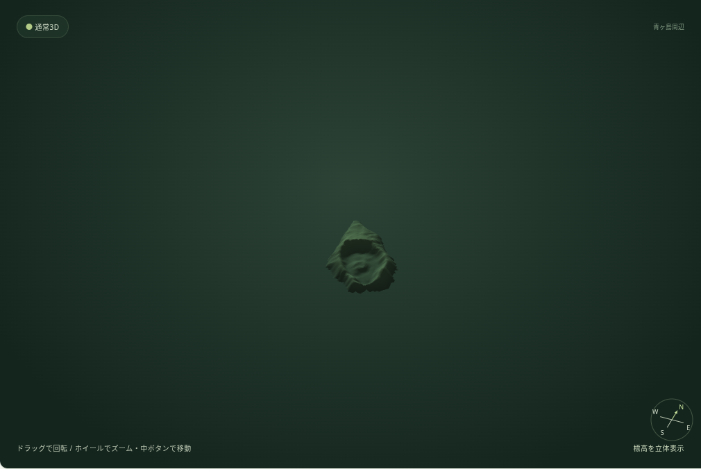
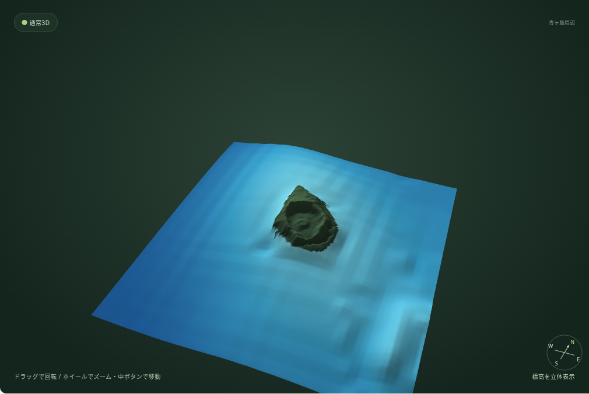
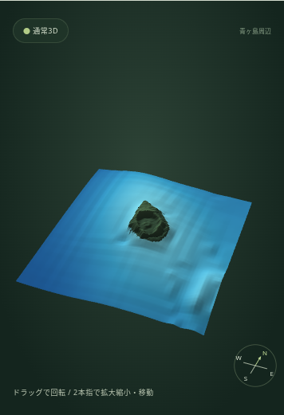
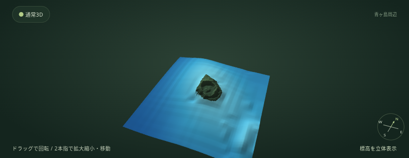

# 海底地形の実データ検証（2026-10-10）

GMRT公式GridServerからGitHub Actionsで取得したGeoTIFF由来の実数値と、国土地理院の実DEMを使用。Playwrightの通信橋渡しはGSIの実応答を保存してブラウザへ渡すもので、標高の合成や海底のモックではない。ChromiumのWebGLはANGLE / SwiftShader。iPhoneのサイズ・タッチ相当を模擬しており、実機Safari・実機GPUの速度は未確認。

## 負荷と描画

| Chromium画面 | ON操作から表示確認まで | 数値取得＋補間 | JS heap OFF→ON | 結果 |
| --- | --- | --- | --- | --- |
| 1440×900 | 0.59秒 | 206ms | 9.2 → 16.5MB | 成功 |
| 390×844 | 0.50秒 | 132ms | 9.1 → 9.8MB | 成功 |
| 844×390 | 0.21秒 | 89ms | 8.7 → 12.8MB | 成功 |

標準画質は37,249頂点で共通。陸地のみ2,772三角形から海底追加後73,728三角形になり、海底35,593点を実表示した。水深範囲は約0〜1,390m。数値ファイルとmanifestは合計524,178 bytes・2リクエスト。繰り返し3回のOFF→ONと高精細・最高精細への変更では海底数値を再取得しなかった。OFF後は海底GPUバッファが解放された。

計時はローカルPages相当のHTTP配信・GSIキャッシュとソフトウェアWebGLによる今回の測定値。公開先から初回アクセスした実機の通信時間・フレームレートの保証ではない。画質を上げても海底データの約207m格子は変わらない。

## 確認した操作

- PC 1440×900、iPhone相当縦390×844・横844×390で実数値の海底を描画。水深の変化と島の立体形状をスクリーンショットで確認。
- ON/OFF前後のGSI陸地の全有効頂点位置・カメラ状態が完全一致。
- 通常3D・平行法・交差法・赤シアン、等高線200m、高さ倍率変更、陰影表示、断面図、連続遊覧中のズームと停止。
- 標準・高精細・最高精細（PC）、共有URLの別ドキュメント読み込みによる海底・設定復元。
- GSI陸地のない沖合へ中心と範囲を変更しても実GMRTで表示。対応外の石鎚山へ移動すると未対応案内、海底の追加通信なし。
- HTTP503時の陸地維持・再試行による復旧。通信途中にOFFした古い応答を適用しないこと。
- JavaScript例外なし、WebGL getError() は0。

`npm test` は既存を含む15ファイル成功。`python tests/bathymetry.browser.py`、`python tests/texture.gpu.browser.py`、`python tests/tour.browser.py` は成功。`python tests/ui.browser.py` もPC・タブレット・スマホ相当8サイズで成功。回転・共有・コンパス・表示範囲変更・立体視・飛行・画面設定を回帰確認した。新設チェック欄に合わせて等高線のテスト対象を明示し、遊覧の再開確認は固定250msの待機から動作を待つ方式へ変更した。ツアー全10場面をPC・スマホ縦横で回帰確認。テクスチャの向き・欠測透明度・全立体視モード・GPU解放も既存テストで成功。

地質図の既存UI回帰はテストタイルを使用し、産総研の実通信成功とは扱わない。海底ON状態で陸地の航空写真・地質図の全地点実配信まで網羅してはいない。海底の現対応範囲外へ機能を拡大して公開することはしていない。

## スクリーンショット

### PC・OFF

### PC・ON

### iPhone相当・縦

### iPhone相当・横

青ヶ島本体のGSI地形は維持され、周囲の実水深が青い斜面として追加される。粗い元資料由来の格子状の見え方もあるため、地形の高精細設定によって測深情報が増えるとは説明しない。海底の分かりやすさを優先して島周囲約12kmを入口にし、詳細な沿岸・小火口の再現は今後の高解像度資料調査の対象とする。
