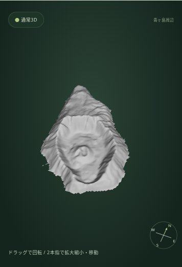
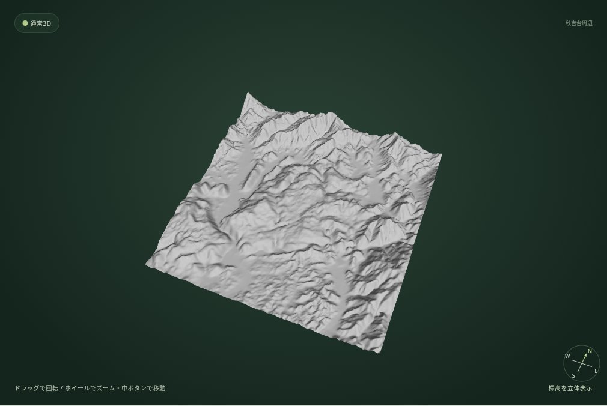

# 名所ガイド 0.27.0 — ブラウザ検証とスクリーンショット

検証日: 2026-10-09。ローカルのアプリをChromium＋Playwright、WebGL（SwiftShader）で実行。画面を実際に操作して確認した。iPhone相当のサイズ・タッチ入力の検証であり、iPhone実機Safariの検証ではない。

## 実データとテスト用データの区別

- 国土地理院の標高・地図・航空写真は公式配信の実データ。ブラウザへの配信には取得済みタイルのキャッシュを使用する。以下の名所スクリーンショットは実DEMを描画したもの。
- 産総研 `gbank.gsj.jp` は開発環境のネットワークプロキシで403となった。実地質図の取得・描画成功は未確認。失敗時の案内、標高色への復帰、視点と範囲の保持は実通信で確認した。
- 地質図の成功経路、凡例、地点クリック情報は明示したテスト用画像・テスト用地質情報で検証。実データの成功とは扱わない。テスト用地質画像はこのギャラリーに含めない。
- GPU等高線の精度・断面図の欠損処理には既知の合成標高データを使う。通常の断面選択、回転、飛行、地図操作には実DEMを使った。

## 実行結果

| 検証 | 結果・範囲 |
| --- | --- |
| `npm test` | 43件成功。既存39件＋名所データ・表示範囲・カメラなど4件 |
| `python tests/landmarks.browser.py` | PC 1440×900で17地点、390×844・844×390で主要6地点を表示。座標・DEMズーム・高さ・表面を検証。全頂点が画面内、カメラが地形に埋まらないことを確認 |
| 同・表示制御 | 地形／地質切替で手動の視点・範囲・高さ・画質を保持。自由地図操作、共有URLの設定優先、おすすめ再適用、DEM失敗後の再試行を確認 |
| 同・ツアー連携 | 秋吉台を選択してツアーを開始、富士山へ移動する実演後に終了。元の名所、モード、分類・地域フィルターを復元 |
| `python tests/ui.browser.py` | 8サイズ。共有、PNG保存、立体視、観察補助、設定、回転、遊覧・手動飛行、自由地図操作を確認 |
| `python tests/geology.browser.py` | PC・縦・横。凡例選択、地点情報、立体視の左右画面、ドラッグ、エラー処理。地質データはテスト用 |
| `python tests/profile.browser.py` | PC・320×568・390×844・844×390・667×375。全立体視モードでの2点選択、画質変更・回転後の保持、取得失敗、欠損区間を確認 |
| `python tests/contours.browser.py` | GPU等高線の位置、高さ強調、陰影、欠損、未対応端末の無効化を確認 |
| `python tests/layer.browser.py` | PC・縦・横。地図／航空写真の往復、404時の復帰、古い取得結果が現在の表面を上書きしないことを確認 |
| `python tests/tour.browser.py` | PC・縦・横の全10場面。自動進行、一時停止、前後移動、復元。スマホの操作・映像が説明パネルに隠れないことを確認 |

完了したブラウザ検証ではJavaScript例外・WebGLエラーなし。名所の詳細結果は [results.json](screenshots/landmarks/results.json)。画面全体の横はみ出しも検査した。

回帰検証で、横画面のツアー断面図が初回表示の1フレームで枠からはみ出す問題を修正。断面図の既存欠損テストは、開始操作で合成データが実DEMに置き換わる準備不備を修正し、アプリの通常処理を変えずに再検証した。

## 主要6地点の確認

中心と表示範囲は地理院地図、公式地理情報・地質資料から調整。実DEMの有効頂点からカメラ距離と注視点を決め、海の欠損部分を基準に島を小さくしない。島は全周、山地は谷と稜線、台地は周囲との段差が画面内に収まることを確認。詳細設定と資料は [設計文書](LANDMARK_GUIDE.md)。

| 名所 | 主な画面確認 | PC | iPhone相当・縦 | iPhone相当・横 | 実地図での範囲 |
| --- | --- | --- | --- | --- | --- |
| 秋吉台 | 台地と周囲の谷・斜面 | [画像](screenshots/landmarks/1440x900-akiyoshidai-real-dem.jpg) | [画像](screenshots/landmarks/390x844-akiyoshidai-real-dem.jpg) | [画像](screenshots/landmarks/844x390-akiyoshidai-real-dem.jpg) | [地図](screenshots/landmarks/1440x900-akiyoshidai-real-map.jpg) |
| 青ヶ島 | 島全体、池の沢火口と丸山 | [画像](screenshots/landmarks/1440x900-aogashima-real-dem.jpg) | [画像](screenshots/landmarks/390x844-aogashima-real-dem.jpg) | [画像](screenshots/landmarks/844x390-aogashima-real-dem.jpg) | [地図](screenshots/landmarks/1440x900-aogashima-real-map.jpg) |
| 黒部峡谷・立山連峰 | 峡谷中上流と西側の高い山地 | [画像](screenshots/landmarks/1440x900-kurobe-real-dem.jpg) | [画像](screenshots/landmarks/390x844-kurobe-real-dem.jpg) | [画像](screenshots/landmarks/844x390-kurobe-real-dem.jpg) | [地図](screenshots/landmarks/1440x900-kurobe-real-map.jpg) |
| 糸魚川周辺 | 海岸、姫川の谷と両側の山地 | [画像](screenshots/landmarks/1440x900-itoigawa-real-dem.jpg) | [画像](screenshots/landmarks/390x844-itoigawa-real-dem.jpg) | [画像](screenshots/landmarks/844x390-itoigawa-real-dem.jpg) | [地図](screenshots/landmarks/1440x900-itoigawa-real-map.jpg) |
| 喜界島 | 島全体と百之台側の高まり | [画像](screenshots/landmarks/1440x900-kikaijima-real-dem.jpg) | [画像](screenshots/landmarks/390x844-kikaijima-real-dem.jpg) | [画像](screenshots/landmarks/844x390-kikaijima-real-dem.jpg) | [地図](screenshots/landmarks/1440x900-kikaijima-real-map.jpg) |
| 南大東島 | 島全体、外周の高まりと低い中央部 | [画像](screenshots/landmarks/1440x900-minamidaito-real-dem.jpg) | [画像](screenshots/landmarks/390x844-minamidaito-real-dem.jpg) | [画像](screenshots/landmarks/844x390-minamidaito-real-dem.jpg) | [地図](screenshots/landmarks/1440x900-minamidaito-real-map.jpg) |

### 青ヶ島・スマホ縦（実DEM）

### 秋吉台・PC（実DEM）

### 解説パネルの配置

通常のページ内に配置し、3D画面に重ねない。縦では1列、PC・横では2列に配置する。3D画面へはスクロールして戻れる。

[PC](screenshots/landmarks/1440x900-akiyoshidai-guide.jpg) · [スマホ縦](screenshots/landmarks/390x844-akiyoshidai-guide.jpg) · [スマホ横](screenshots/landmarks/844x390-aogashima-guide.jpg)

## 未確認事項と第2段階

実機Safariの性能・操作、実地質タイルの成功表示は未確認。海底・地下構造・細かなドリーネや現在の火口を再現する機能は追加していない。低い島の段差は高さ4倍・陰影で見やすくしたが、既存100m等高線では不足するため、第2段階では等高線間隔、観察地点への近接設定、地質専門家による説明の確認、実機Safariと実地質データでの検証を優先する。

公開確認はコミット後にGitHub ActionsのPagesビルド・デプロイを確認し、完了報告に記載する。
