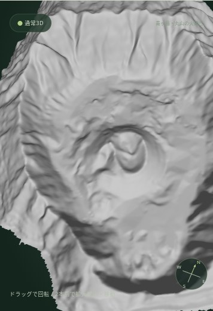
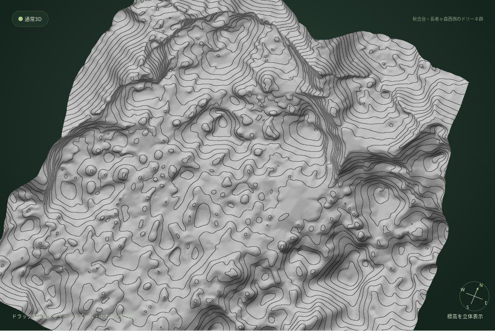
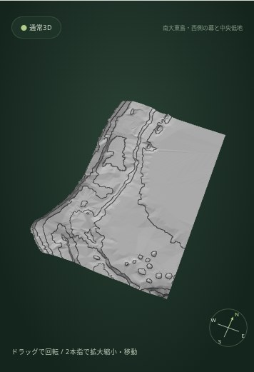

# 第2段階 0.28.0 — 実DEMの表示検証

2026-10-09、ローカルのアプリをChromium＋Playwright、WebGL（SwiftShader）で操作。PC 1440×900、iPhone相当390×844・844×390で、6名所・10スポットすべてを確認した。実機Safariの検証とは区別する。

## 結果

- `npm test`: 47件すべて成功。追加した見どころデータの資料・位置・範囲、等高線間隔の制約、共有リンクの新旧互換性を含む。
- `python tests/landmark-spots.browser.py`: 各サイズ10スポット。名所全体→見どころ→名所全体、必要な実DEMの取得、注目範囲の画面内への収まり、十分な画面占有、カメラが全有効地形より上にあることを確認。等高線間隔で画素が変わり、DEM再取得やカメラ変更が起きないことも検査。
- 見どころで地質モードを切り替えても場所・カメラ・高さ・画質・等高線間隔は保持。ツアーの開始・途中終了で見どころと10m等高線を復元。DEM取得失敗時は直前の場所と設定を保持し、再試行で移動できる。
- 共有リンクで見どころの座標・カメラ・高さ・等高線間隔を復元し、名所のおすすめは自動適用しない。
- `tests/ui.browser.py`: 8サイズの既存UI、自由な地図操作、PNG保存、共有、観察補助、通常3D・立体視、回転、高さ、画質、遊覧飛行・手動飛行を確認。
- `tests/profile.browser.py`: PCとスマホ相当5サイズ。全立体視モードで2点選択、断面、画質・回転時の保持、取得失敗、欠損処理を確認。
- `tests/layer.browser.py`: PC・縦・横。実地図・航空写真の切替、404、古いリクエストが表面を上書きしないことを確認。
- `tests/contours.browser.py`: 合成した既知の実標高で10・20・50・100・200mの線と中間の画素を検証。平坦面、欠損、OFF復帰、描画非対応時の安全なUIを確認。
- `tests/texture.gpu.browser.py`: テスト画像で方位・投影、欠損、立体視、GPU資源の解放を確認。
- `tests/geology.browser.py`: テスト用地質データで凡例、地点選択、左右眼、スクロール、ドラッグ、取得失敗をPC・縦・横で確認。
- `tests/geology-transparency.browser.py`: 公式仕様に合わせたテスト用の透明PNGで、全体欠損の通知と部分欠損の地形保持を確認。
- `tests/tour.browser.py`: PC・縦・横の全10場面、自動完了、途中終了、一時停止、状態復元、スマホの操作と3Dが説明パネルに隠れないことを確認。
- `tests/landmarks.browser.py`: PCの既存17名所すべての実DEM表示、自由な地図選択、分類、地質切替・凡例（成功はテスト用画像）、共有、ツアー連携を再検証。

完了した各検証ではJavaScript例外・WebGLエラーなし。新規UIの横はみ出しもなし。見どころの詳細数値は [results.json](screenshots/observation-stage2/results.json)。

## 見どころの見え方と調整

画面内にあるという数値だけでなく、スクリーンショットを目視して地形の特徴を評価した。丸山は円錐形・山頂のくぼみ、秋吉台は大きなドリーネ群、黒部は谷と山地の高低差、中岳は南北の火口のくぼみ、百之台は平坦面と東側の急斜面、南大東は高い縁と低地を確認した。

南大東の中央低地は、最初の中心25.843,131.241では北側の高まりが弱く、注目範囲の標高差が18mしかなかった。地理院地図を再確認して中心25.862,131.240へ調整。55mの起伏と北縁・中央低地の違いが分かるようになった。調整後にPC・縦・横を再検証した。

見どころへ近づく表示は注目範囲を大きく見せるため、DEMの外縁が画面外に出る場合がある。観察対象は画面内で、表示している地形はすべて取得済みの実DEM。小さなドリーネ、岩石の粒、地下・海底、現在の火口を精密に再現したと扱わない。

## 全10スポットのスクリーンショット

以下は[国土地理院の実DEM](https://maps.gsi.go.jp/development/ichiran.html#dem)。地質のテスト画像は含めない。

| 名所／見どころ | PC | iPhone相当・縦 | iPhone相当・横 |
| --- | --- | --- | --- |
| 青ヶ島／池の沢火口 | [画像](screenshots/observation-stage2/1440x900-aogashima-ikenosawa-real-dem.jpg) | [画像](screenshots/observation-stage2/390x844-aogashima-ikenosawa-real-dem.jpg) | [画像](screenshots/observation-stage2/844x390-aogashima-ikenosawa-real-dem.jpg) |
| 青ヶ島／丸山の火砕丘 | [画像](screenshots/observation-stage2/1440x900-aogashima-maruyama-real-dem.jpg) | [画像](screenshots/observation-stage2/390x844-aogashima-maruyama-real-dem.jpg) | [画像](screenshots/observation-stage2/844x390-aogashima-maruyama-real-dem.jpg) |
| 秋吉台／長者ヶ森西側のドリーネ群 | [画像](screenshots/observation-stage2/1440x900-akiyoshidai-chojagamori-real-dem.jpg) | [画像](screenshots/observation-stage2/390x844-akiyoshidai-chojagamori-real-dem.jpg) | [画像](screenshots/observation-stage2/844x390-akiyoshidai-chojagamori-real-dem.jpg) |
| 黒部峡谷・立山連峰／仙人谷付近の深い峡谷 | [画像](screenshots/observation-stage2/1440x900-kurobe-sennindani-real-dem.jpg) | [画像](screenshots/observation-stage2/390x844-kurobe-sennindani-real-dem.jpg) | [画像](screenshots/observation-stage2/844x390-kurobe-sennindani-real-dem.jpg) |
| 黒部峡谷・立山連峰／阿曽原谷との合流部 | [画像](screenshots/observation-stage2/1440x900-kurobe-asohara-real-dem.jpg) | [画像](screenshots/observation-stage2/390x844-kurobe-asohara-real-dem.jpg) | [画像](screenshots/observation-stage2/844x390-kurobe-asohara-real-dem.jpg) |
| 阿蘇山／中央火口丘群 | [画像](screenshots/observation-stage2/1440x900-aso-central-cones-real-dem.jpg) | [画像](screenshots/observation-stage2/390x844-aso-central-cones-real-dem.jpg) | [画像](screenshots/observation-stage2/844x390-aso-central-cones-real-dem.jpg) |
| 阿蘇山／中岳火口周辺 | [画像](screenshots/observation-stage2/1440x900-aso-nakadake-real-dem.jpg) | [画像](screenshots/observation-stage2/390x844-aso-nakadake-real-dem.jpg) | [画像](screenshots/observation-stage2/844x390-aso-nakadake-real-dem.jpg) |
| 喜界島／百之台と東側の段丘崖 | [画像](screenshots/observation-stage2/1440x900-kikaijima-hyakunoday-real-dem.jpg) | [画像](screenshots/observation-stage2/390x844-kikaijima-hyakunoday-real-dem.jpg) | [画像](screenshots/observation-stage2/844x390-kikaijima-hyakunoday-real-dem.jpg) |
| 南大東島／西側の幕と中央低地 | [画像](screenshots/observation-stage2/1440x900-minamidaito-western-rim-real-dem.jpg) | [画像](screenshots/observation-stage2/390x844-minamidaito-western-rim-real-dem.jpg) | [画像](screenshots/observation-stage2/844x390-minamidaito-western-rim-real-dem.jpg) |
| 南大東島／中央低地と北側の高まり | [画像](screenshots/observation-stage2/1440x900-minamidaito-central-lowland-real-dem.jpg) | [画像](screenshots/observation-stage2/390x844-minamidaito-central-lowland-real-dem.jpg) | [画像](screenshots/observation-stage2/844x390-minamidaito-central-lowland-real-dem.jpg) |

### 丸山・スマホ縦

### 秋吉台・10m等高線

### 南大東島・高まりと低地

[PCの見どころ操作](screenshots/observation-stage2/1440x900-aogashima-maruyama-controls.jpg) · [スマホ縦](screenshots/observation-stage2/390x844-aogashima-maruyama-controls.jpg) · [スマホ横](screenshots/observation-stage2/844x390-aogashima-maruyama-controls.jpg)

全体との比較は同じフォルダーの `1440x900-名所ID-overview.jpg`。例えば [青ヶ島全体](screenshots/observation-stage2/1440x900-aogashima-overview.jpg) と [丸山](screenshots/observation-stage2/1440x900-aogashima-maruyama-real-dem.jpg)。

## 実データと未確認事項

標高・地図・航空写真は公式の実データを取得済みキャッシュからブラウザへ渡した。原データの不在による404は既存の親タイル補完を使用し、合成地形で代用していない。等高線の精度や欠損処理は既知の合成データでも検証した。

産総研は開発環境のHTTPSプロキシがトンネル確立時に403で拒否。実地質図・実凡例の成功表示は未確認。一般利用者のブラウザでの403とは同一視しない。テスト用地質画像でのUI成功を実データ成功とみなさない。調査結果、公式仕様との照合、iPhone Safariの具体的な確認手順は [設計・API調査](OBSERVATION_STAGE2.md) に記載。

iPhone実機Safariの操作・GPU性能は未確認。Chromiumの画面サイズ・タッチ入力の検証である。

GitHub ActionsとPagesの結果はコミット後に確認し、完了報告に記載する。
